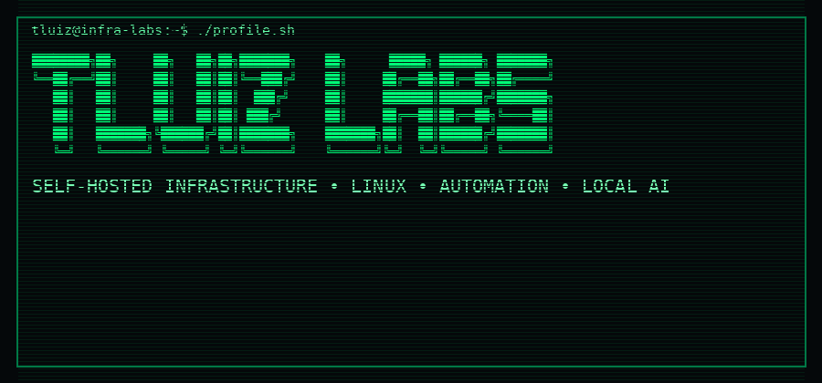

  

# IT Infrastructure Analyst

**Linux • Windows Server • Networking • Monitoring • Automation • CloudOps/DevOps Path**

IT Infrastructure professional with hands-on experience in support, servers, networking, monitoring, automation and technical documentation.

My work combines traditional infrastructure operations with scripting, containers, self-hosted services and local AI. My current career direction is CloudOps/DevOps, adding public cloud, infrastructure as code and CI/CD to the operational foundation I already use in real environments.

---

## Core Experience

| Area | Technologies and practices |
|---|---|
| Systems | Linux, Debian, Ubuntu, Windows Server, Active Directory, Group Policy |
| Networking | TCP/IP, DNS, DHCP, switching, troubleshooting, SSH, VNC |
| Monitoring | Zabbix, Grafana, logs, alerts and incident investigation |
| ITSM and inventory | GLPI and OCS Inventory |
| Automation | Bash, PowerShell, Python, REST APIs and webhooks |
| Containers and virtualization | Docker, Docker Compose, XCP-ng and self-hosted services |
| Applied AI | Ollama, Open WebUI, local models, RAG experiments and offline-first environments |

---

## Featured Projects

### [SENTINELA-AI](https://github.com/lteodoro780/SENTINELA-AI)

Local AI assistant designed to support infrastructure teams with internal documentation, technical support, monitoring data and operational automation.

**Highlights**

- Self-hosted and offline-first architecture
- Ollama and Open WebUI integration
- RAG-oriented knowledge base
- Experimental integrations with GLPI, Zabbix and Grafana
- API and Telegram workflows
- Privacy-oriented deployment for restricted networks

**Stack:** Linux, Docker, Python, FastAPI, Ollama, Open WebUI, GLPI and Zabbix

---

### [Vanguardeira Project](https://github.com/lteodoro780/vanguardeira-project)

Infrastructure and digital inclusion project that transformed repurposed ARM TV Boxes into lightweight Linux computers.

**Highlights**

- Deployment and standardization involving 60 repurposed devices
- Linux and ARM hardware validation
- Armbian and Debian ARM64 experiments
- Amlogic and Rockchip device testing
- Boot, storage, eMMC and SD card documentation
- Low-cost infrastructure and hardware reuse

**Stack:** Armbian, Debian ARM64, Linux, Amlogic, Rockchip, eMMC and Embedded Linux

---

### [Infra TI Labs](https://github.com/lteodoro780/infra-ti-labs)

Practical labs and documentation about infrastructure, Linux, Windows Server, networking, monitoring and automation.

**Stack:** Debian, Ubuntu, Windows Server, Active Directory, Zabbix, GLPI, OCS Inventory, PowerShell and Shell Script

---

### [Hermes Security Portable](https://github.com/lteodoro780/hermes-security-portable)

Portable local assistant for offline defensive diagnostics, infrastructure support and technical troubleshooting.

**Stack:** Python, llama.cpp, GGUF, Local AI, Windows and a lightweight Web UI

---

## Current Career Roadmap

These are active learning and portfolio goals, not claims of professional production experience:

1. AWS foundations: IAM, VPC, EC2, S3, RDS and CloudWatch
2. Infrastructure as Code with Terraform
3. Configuration automation with Ansible
4. CI/CD pipelines with GitHub Actions
5. Production-oriented Python with logging, tests and APIs
6. Docker Compose patterns, backup and secrets management
7. Kubernetes fundamentals and observability

The objective is to connect my existing infrastructure background with reproducible, monitored and automated cloud environments.

---

## Target Roles

- IT Infrastructure Analyst
- Linux Systems Administrator
- Cloud Support Analyst
- Junior CloudOps Analyst
- Junior DevOps Analyst
- Infrastructure Automation Analyst

---

## Portfolio Principles

Every project should explain:

- the original problem;
- the architecture and technical decisions;
- implementation and troubleshooting;
- security and privacy considerations;
- measurable results;
- how to reproduce the solution safely.

---

## Contact

- LinkedIn: [Luis O. Florencio](https://www.linkedin.com/in/luis-o-florencio/)
- GitHub: [@lteodoro780](https://github.com/lteodoro780)
- Email: lteodoro780@gmail.com
